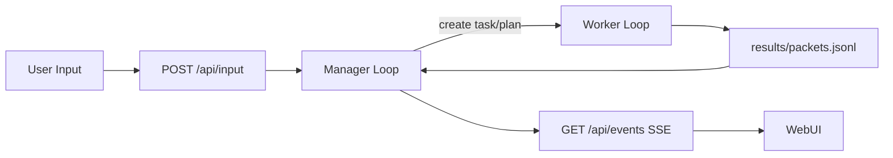

# Mimikit

[](./tsconfig.json)
[](./LICENSE)
[](./docs/design/architecture/system-architecture.md)

Mimikit is for developers who want a controllable local AI assistant runtime instead of a black-box SaaS agent.
It keeps one main session with explicit `manager + worker` orchestration, a built-in WebUI, and file-backed runtime state for reproducible debugging.

**Primary action: try it locally.**

```bash
git clone https://github.com/phonowell/mimikit.git
cd mimikit
pnpm i
OPENAI_API_KEY=your_key pnpm start
# open http://localhost:8787
```

## Table of Contents

- [Quickstart](#quickstart)
- [LLM Bootstrap](#llm-bootstrap)
- [Features](#features)
- [How It Works](#how-it-works)
- [Use Cases](#use-cases)
- [Benchmark Positioning](#benchmark-positioning)
- [FAQ](#faq)
- [Contributing](#contributing)
- [License](#license)

## Quickstart

### 1) Install dependencies

```bash
pnpm i
```

### 2) Configure API key

Mimikit reads provider settings from `~/.codex/config.toml` and environment variables (see [`src/providers/codex-settings.ts`](./src/providers/codex-settings.ts)).
API key resolution order:

1. Active provider in `~/.codex/config.toml`: `api_key`
2. Active provider in `~/.codex/config.toml`: `env_key` / `api_key_env` (read from that env var)
3. `OPENAI_API_KEY`
4. `~/.codex/auth.json` (`OPENAI_API_KEY`)

```bash
export OPENAI_API_KEY=your_key
```

If you use a custom Codex-compatible provider, configure `base_url` and `env_key` in the active provider:

```toml
model_provider = "aicoding"

[model_providers.aicoding]
base_url = "https://your-codex-provider.example.com/v1/codex"
wire_api = "responses"
env_key = "AICODING_API_KEY"
```

Manager provider model settings are configured in `config.yaml`:

If `config.yaml` is missing, Mimikit will bootstrap it from `defaults/config.template.yaml`.

```yaml
manager:
  provider:
    model: gpt-5.2-high
    modelReasoningEffort: high
```

- manager calls route directly to `openai-responses`
- worker calls route to `codex-sdk`

### 3) Start WebUI + API

```bash
pnpm start
```

Default port is `8787`; you can also run:

```bash
tsx src/cli/index.ts --port 8787 --work-dir .mimikit
```

## LLM Bootstrap

For LLM-driven setup and configuration, use [`docs/BOOTSTRAP.md`](./docs/BOOTSTRAP.md). It provides deterministic install/config/start/verify steps.

## Features

- Single-session runtime: one main session loop, no multi-session routing complexity ([architecture](./docs/design/architecture/system-architecture.md)).
- Explicit orchestration split: `manager` handles dialogue/planning, `worker` handles execution ([architecture](./docs/design/architecture/system-architecture.md)).
- Plan trigger modes: `cron`, `scheduled_at`, `on_idle`, `on_worker_slot_freed` with clear semantics ([plan workflow](./docs/design/workflow/plan.md)).
- Built-in WebUI + SSE events: `GET /api/events`, `POST /api/input`, restart/reset APIs ([interfaces](./docs/design/workflow/interfaces-and-state.md)).
- QQ channel integration (optional): webhook ingest + passive reply guard + de-dup state ([QQ modules](./src/channels/qq)).
- Local file-backed observability: `history`, `tasks`, `task-progress`, `runtime-snapshot`, `log.jsonl` under `.mimikit/` ([state layout](./docs/design/workflow/interfaces-and-state.md)).

Keywords: `AI assistant`, `TypeScript agent`, `Codex SDK`, `OpenAI`, `single-session orchestration`, `WebUI`, `SSE`, `task planning`, `QQ bot`, `local-first runtime`.

## How It Works



Key points:

- Inputs and task results are persisted, then re-consumed by manager for deterministic round progression.
- `triggerWakeLoop` evaluates timed/idle/capacity plans and emits trigger events.
- Runtime snapshot supports restart/reset with cursor reconciliation.

## Use Cases

- Build a controllable personal assistant runtime where state, plans, and task traces are inspectable on disk.
- Prototype agent scheduling behavior (`on_idle` vs `on_worker_slot_freed`) with explicit semantics.
- Run one local assistant with both WebUI input and optional QQ webhook channel.
- Use this repo as a compact TypeScript reference for manager/worker split orchestration.

## Benchmark Positioning

Compared with public agent projects, Mimikit intentionally optimizes for single-session controllability over channel breadth or hardware extremity.

| Repo | Public positioning (from README) | Mimikit differentiation |
| --- | --- | --- |
| [HKUDS/nanobot](https://github.com/HKUDS/nanobot) | Ultra-lightweight personal assistant with broad channels/providers | Mimikit emphasizes explicit workflow semantics (`on_idle`/`on_worker_slot_freed`) and local runtime-state inspectability |
| [sipeed/picoclaw](https://github.com/sipeed/picoclaw) | Go-based assistant targeting low-cost, low-memory hardware | Mimikit focuses on TypeScript orchestration clarity and WebUI/SSE development loop |
| [memovai/mimiclaw](https://github.com/memovai/mimiclaw) | ESP32 pure-C assistant via Telegram on microcontroller-class device | Mimikit targets desktop/server local runtime with richer plan/task/state management |
| [agentscope-ai/CoPaw](https://github.com/agentscope-ai/CoPaw) | Multi-channel personal assistant platform with broad integrations | Mimikit keeps a narrower scope for lower mental overhead and faster architecture iteration |

## FAQ

### Is Mimikit multi-session?

No. Current architecture is single main session by design.

### Which APIs are available for UI integration?

At minimum: `GET /api/events` (SSE) and `POST /api/input`, plus task/choice/restart/reset endpoints.

### Does it support scheduled or idle-triggered automation?

Yes. Plans support `cron`, `scheduled_at`, `on_idle`, and `on_worker_slot_freed`.

### Can I enable QQ integration?

Yes. Configure `qq.*` in `config.yaml` or `QQ_*` env vars, then enable webhook route.

## Contributing

- Keep changes minimal and traceable to code/docs facts.
- Follow project constraints in [`AGENTS.md`](./AGENTS.md) and lint before merging.
- For worktree workflow: run `pnpm run wt-rebase`, implement, review, then `pnpm run wt-land`.

## License

MIT, see [LICENSE](./LICENSE).
