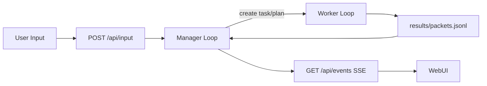

# Mimikit

[](./tsconfig.json)
[](./LICENSE)
[](./docs/design/architecture/system-architecture.md)
[](https://github.com/phonowell/mimikit/actions/workflows/ci.yml)

Mimikit is a thin local orchestration layer around Codex for teams that want controllable behavior without adding another heavy agent stack.
It keeps one main session with explicit `manager + worker` orchestration, a built-in WebUI, and file-backed runtime state for reproducible debugging. Mimikit is orchestration-only: direct task execution is delegated to external runtimes/providers.

**Primary action: try it locally.**

```bash
git clone https://github.com/phonowell/mimikit.git
cd mimikit
pnpm run bootstrap
pnpm i
OPENAI_API_KEY=your_key pnpm start
# open http://localhost:8787
```

`bootstrap` 会自动 clone `../mimikit-providers`，并通过 `pnpm install` 安装分仓依赖。

## Table of Contents

- [Quickstart](#quickstart)
- [Positioning](#positioning)
- [LLM Bootstrap](#llm-bootstrap)
- [Features](#features)
- [How It Works](#how-it-works)
- [Prompt Governance](#prompt-governance)
- [Minimal API Smoke Test](#minimal-api-smoke-test)
- [Use Cases](#use-cases)
- [Benchmark Positioning](#benchmark-positioning)
- [FAQ](#faq)
- [Contributing](#contributing)
- [License](#license)

## Positioning

Mimikit optimizes for low token usage and low mental overhead. The design keeps only the minimum concepts needed to run reliably: one session loop, one orchestration boundary, and one consistent state layout. It favors out-of-the-box startup with minimal configuration over deep tuning surfaces.

Mimikit intentionally reuses Codex capabilities instead of rebuilding overlapping in-repo layers. The orchestration layer stays thin, and the implementation stays compact: it coordinates state, plans, and scheduling, while execution remains delegated to external runtimes.

Interaction is conversational and task-oriented, similar to working with a teammate in chat, but Mimikit does not present itself as a human identity. The product boundary is explicit: Mimikit provides orchestration and observability, and Codex capability is treated as the core capability surface.

## Quickstart

### 1) Install dependencies

Mimikit reads provider settings from `~/.codex/config.toml` and environment variables (see [`src/providers/codex-settings.ts`](./src/providers/codex-settings.ts)).
API key resolution order:

1. Active provider in `~/.codex/config.toml`: `api_key`
2. Active provider in `~/.codex/config.toml`: `env_key` / `api_key_env` (read from that env var)
3. `OPENAI_API_KEY`
4. `~/.codex/auth.json` (`OPENAI_API_KEY`)

```bash
git clone https://github.com/phonowell/mimikit.git
cd mimikit
pnpm i
```

### 2) Configure API key

macOS / Linux:

```bash
export OPENAI_API_KEY=your_key
```

Windows PowerShell:

```powershell
$env:OPENAI_API_KEY = "your_key"
```

Windows CMD:

```cmd
set OPENAI_API_KEY=your_key
```

If you use a custom Codex-compatible provider, configure `base_url` and `env_key` in the active provider:

```toml
model_provider = "aicoding"

[model_providers.aicoding]
base_url = "https://your-codex-provider.example.com/v1/codex"
wire_api = "responses"
env_key = "AICODING_API_KEY"
```

Manager/provider model settings are configured in `config.toml`:

If `config.toml` is missing, run `pnpm run bootstrap` to generate it from `defaults/config.template.toml`.

```toml
[manager]
model = "gpt-5.2"
modelReasoningEffort = "medium"

# optional manager-only provider overrides
baseUrl = ""
apiKey = ""
proxy = ""

[worker]
maxConcurrent = 3
timeoutMs = 600000

[codex]
enabled = true
model = "gpt-5.3-codex"
modelReasoningEffort = "high"
capability = "high"
billing = "medium"
proxy = ""

[opencode]
enabled = false
model = "big-pickle"
capability = "low"
billing = "low"
proxy = ""

[webui]
enabled = true
```

- manager calls route directly to `openai-responses`
- worker execution routes by task provider:
  - `provider="codex"` -> `codex-sdk`
  - `provider="opencode"` -> `opencode-sdk` (`@opencode-ai/sdk`)
- manager only sees enabled worker providers in `M:environment` as `provider_candidates`
- `enqueue_task` supports optional `provider="codex|opencode"`
- if `provider` is omitted, runtime auto-selects by config: lowest `billing` first, then strongest `capability`
- high-cost `enqueue_task` now requires explicit user confirmation via `ask_user_choice`; confirmation option is `option-confirm-dispatch`, default is cancel
- mixed wake rounds now use `standard` context budget (no automatic heavy escalation)

### 3) Start WebUI + API

```bash
pnpm start
```

`pnpm start` auto-runs dependency check and enters restart wrapper:

- Windows: `bin/mimikit.cmd` (CMD-safe; callable from PowerShell/CMD)
- Unix: `bin/mimikit`

Default port is `8787`; direct start without wrapper:

```bash
tsx src/cli/index.ts --port 8787 --work-dir .mimikit
```

Action lifecycle logs are printed to CLI by default (tag: `[manager] action`) and always persisted to `.mimikit/log.jsonl` as `event="manager_action"`. You can control CLI printing with:

```bash
MIMIKIT_ACTION_LOGS=false pnpm start
# or
tsx src/cli/index.ts --log-actions false

# observability additions in log.jsonl
# - event="run_task_confirmation_required"
# - event="manager_correction_structured_clarify"
# - event="worker_long_task_soft_limit"
# - worker_end includes usageCaptured for canceled tasks
```

### 4) Optional: enable Telegram channel

```bash
export TELEGRAM_CHANNEL_ENABLED=true
export TELEGRAM_BOT_TOKEN=<your_bot_token>
export TELEGRAM_CHAT_ID=<your_chat_id>
export TELEGRAM_PROXY=http://127.0.0.1:7897 # optional
pnpm start
```

`webui.enabled=true` (default) and `telegram.enabled=true` can run together in one process.

### 5) Optional: enable Feishu channel

```bash
export FEISHU_CHANNEL_ENABLED=true
export FEISHU_APP_ID=<your_app_id>
export FEISHU_APP_SECRET=<your_app_secret>
export FEISHU_CHAT_ID=<your_chat_id> # optional
pnpm start
```

`webui.enabled=true` (default) and `feishu.enabled=true` can run together in one process.

## LLM Bootstrap

For LLM-driven setup and configuration, use [`docs/BOOTSTRAP.md`](./docs/BOOTSTRAP.md). It provides deterministic install/config/start/verify steps.

## Features

- Single-session runtime: one main session loop, no multi-session routing complexity ([architecture](./docs/design/architecture/system-architecture.md)).
- Explicit orchestration split: `manager` handles dialogue/planning, `worker` handles execution dispatch + result ingestion via external runtimes ([architecture](./docs/design/architecture/system-architecture.md)).
- Plan trigger modes: `cron`, `scheduled_at`, `on_worker_slot_freed` with clear semantics ([plan workflow](./docs/design/workflow/plan.md)).
- Built-in WebUI + SSE events: `GET /api/events`, `POST /api/input`, restart/reset APIs ([interfaces](./docs/design/workflow/interfaces-and-state.md)).
- Task panel live progress: running tasks show streamed output snippets in WebUI without extra model calls.
- Telegram channel integration (optional): long polling ingest + passive reply via `sendMessage` ([Telegram modules](./src/channels/telegram)).
- Feishu channel integration (optional): long connection ingest + passive reply via IM message API ([Feishu modules](./src/channels/feishu)).
- Local file-backed observability: `history`, `tasks`, `task-progress`, `runtime-snapshot`, `log.jsonl` under `.mimikit/` ([state layout](./docs/design/workflow/interfaces-and-state.md)).

Keywords: `AI orchestration layer`, `TypeScript orchestrator`, `Codex SDK`, `OpenAI`, `single-session orchestration`, `WebUI`, `SSE`, `task planning`, `Telegram bot`, `Feishu bot`, `local-first runtime`.


## Prompt Governance

- Prompts must live in `prompts/**`; business logic should load templates instead of embedding long natural-language literals in `src/**`.
- Lint includes `scripts/prompt-hardcode-guard.ts`, which blocks new hardcoded prompt-like literals in critical runtime paths.
- If an exception is unavoidable, annotate with `prompt-guard-exempt:{reason}` and document the rationale.
- Full policy and examples: [`docs/design/workflow/prompt-governance.md`](./docs/design/workflow/prompt-governance.md).

## How It Works



Key points:

- Inputs and task results are persisted, then re-consumed by manager for deterministic round progression.
- `triggerWakeLoop` evaluates timed/capacity plans and emits trigger events.
- Runtime snapshot supports restart/reset with cursor reconciliation.

## Minimal API Smoke Test

After `pnpm start`, verify API status without triggering model/provider execution.

macOS / Linux:

```bash
curl -sS http://127.0.0.1:8787/api/status
```

Windows PowerShell:

```powershell
Invoke-RestMethod http://127.0.0.1:8787/api/status | ConvertTo-Json -Depth 5
```

Expected: `/api/status` returns JSON with runtime fields like `ok`, `runtimeId`, and `managerRunning`.

Optional manual check (may incur model/provider token cost, run only when needed):

```bash
curl -sS -X POST http://127.0.0.1:8787/api/input \
  -H 'content-type: application/json' \
  -d '{"text":"hello from quickstart"}'
```

## Use Cases

- Build a controllable local orchestration runtime where state, plans, and task traces are inspectable on disk.
- Prototype agent scheduling behavior (`on_worker_slot_freed`) with explicit semantics.
- Run one local orchestration hub with WebUI input and optional Telegram/Feishu bot channels.
- Use this repo as a compact TypeScript reference for manager/worker split orchestration where execution is externally delegated.

## Benchmark Positioning

Compared with public agent projects, Mimikit intentionally optimizes for single-session controllability over channel breadth or hardware extremity.

| Repo                                                          | Public positioning (from README)                                    | Mimikit differentiation                                                                                        |
| ------------------------------------------------------------- | ------------------------------------------------------------------- | -------------------------------------------------------------------------------------------------------------- |
| [HKUDS/nanobot](https://github.com/HKUDS/nanobot)             | Ultra-lightweight personal assistant with broad channels/providers  | Mimikit emphasizes explicit workflow semantics (`on_worker_slot_freed`) and local runtime-state inspectability |
| [sipeed/picoclaw](https://github.com/sipeed/picoclaw)         | Go-based assistant targeting low-cost, low-memory hardware          | Mimikit focuses on TypeScript orchestration clarity and WebUI/SSE development loop                             |
| [memovai/mimiclaw](https://github.com/memovai/mimiclaw)       | ESP32 pure-C assistant via Telegram on microcontroller-class device | Mimikit targets desktop/server local runtime with richer plan/task/state management                            |
| [agentscope-ai/CoPaw](https://github.com/agentscope-ai/CoPaw) | Multi-channel personal assistant platform with broad integrations   | Mimikit keeps a narrower scope for lower mental overhead and faster architecture iteration                     |

## FAQ

### Is Mimikit multi-session?

No. Current architecture is single main session by design.

### Which APIs are available for UI integration?

At minimum: `GET /api/events` (SSE) and `POST /api/input`, plus task/choice/restart/reset endpoints.

### Does it support image input?

Not yet. Current input is text-only. For Telegram/Feishu, image messages are converted into a text-only capability notice so the manager can reply and ask the user to describe the request in plain text.

### Does it support scheduled or capacity-triggered automation?

Yes. Plans support `cron`, `scheduled_at`, and `on_worker_slot_freed`.

### Can I enable Telegram integration?

Yes. Configure `telegram.*` in `config.toml` or `TELEGRAM_*` env vars, then start with `telegram.enabled=true`.

### Can I enable Feishu integration?

Yes. Configure `feishu.*` in `config.toml` or `FEISHU_*` env vars, then start with `feishu.enabled=true`.

### Can I disable WebUI and keep bot channels only?

Yes. Set `webui.enabled=false` in `config.toml`; Telegram/Feishu channels still work when enabled.

## Contributing

- Keep changes minimal and traceable to code/docs facts.
- Follow project constraints in [`AGENTS.md`](./AGENTS.md) and lint before merging.
- For worktree workflow: use `pnpm run wt-slot start` to allocate+rebase, then `pnpm run wt-slot finish` to run review gate + land + release. See [worktree workflow](./docs/design/workflow/worktree.md).

## License

MIT, see [LICENSE](./LICENSE).
