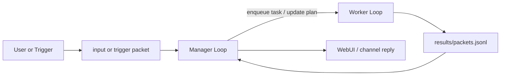

# Mimikit

[](./tsconfig.json)
[](./LICENSE)
[](./docs/design/architecture/system-architecture.md)
[](https://github.com/phonowell/mimikit/actions/workflows/ci.yml)

Mimikit 是面向夜班值守与周期任务的低成本自治作业系统。它保持单一主 session，用 `manager + worker` 驱动作业闭环，把真正执行委托给外部运行时，并把状态、计划、日志与恢复点持久化到本地。

它不是通用 agent 平台。保留的边界只有四件事：周期触发、低成本常驻、失败恢复、最小人工确认。

## Positioning

- 低常驻成本：单 session、单 manager loop、外部执行运行时复用，避免为夜班值守额外维护多层 agent 编排。
- 周期执行与恢复：支持 `cron`、`scheduled_at`、`on_worker_slot_freed`，并把运行时快照落盘，重启后可继续。
- 最小确认边界：高成本任务需要显式确认；其他链路尽量自动推进到明确收尾条件。
- 可观察值守：WebUI、CLI action log、`.mimikit/` 状态目录用于观察夜间执行，而不是扩展更多平台概念。

## Quickstart

### 1) 安装依赖

Mimikit 从 `~/.codex/config.toml` 和环境变量读取 provider 设置，加载入口见 [`src/cli/index.ts`](./src/cli/index.ts)。API key 解析顺序：

1. `~/.codex/config.toml` 当前 provider 的 `api_key`
2. `~/.codex/config.toml` 当前 provider 的 `env_key` / `api_key_env`
3. `OPENAI_API_KEY`
4. `~/.codex/auth.json` 中的 `OPENAI_API_KEY`

```bash
git clone https://github.com/phonowell/mimikit.git
cd mimikit
pnpm i
```

### 2) 配置 API key

macOS / Linux:

```bash
export OPENAI_API_KEY=your_key
```

```powershell
$env:OPENAI_API_KEY = "your_key"
```

Windows CMD:

```cmd
set OPENAI_API_KEY=your_key
```

如使用自定义 Codex 兼容 provider，可在活动 provider 中配置：

```toml
model_provider = "aicoding"

[model_providers.aicoding]
base_url = "https://your-codex-provider.example.com/v1/codex"
wire_api = "responses"
env_key = "AICODING_API_KEY"
```

```toml
[manager]
model = "gpt-5.2"
modelReasoningEffort = "medium"

[worker]
maxConcurrent = 3
timeoutMs = 600000

[worker.budget]
maxDurationMs = 1800000
maxRounds = 3

[codex]
enabled = true
model = "gpt-5.3-codex"
modelReasoningEffort = "high"
capability = "high"
billing = "medium"

[opencode]
enabled = false
model = "big-pickle"
capability = "low"
billing = "low"

[webui]
enabled = true
```

运行时选择规则：

- manager 调用走 `openai-responses`
- worker 按任务 `provider` 路由到 `codex-sdk` 或 `opencode-sdk`
- 未指定 `provider` 时，按最低 `billing`、再按最高 `capability` 自动选择
- 高成本 `enqueue_task` 先触发 `ask_user_choice` 确认，再允许派发
- 长任务命中 `worker.budget` 时不会直接失败；会归档部分结果、保留 session，并把任务置为 `paused` 等待显式恢复
- WebUI 会把 `Done / Need resume / Need input / Resumed` 聚合成值守状态面板，方便夜班快速判断当前介入点

### 3) 启动

```bash
pnpm start
```

```bash
tsx src/cli/index.ts --port 8787 --work-dir .mimikit
```

CLI 默认输出 action 生命周期日志，并始终将其写入 `.mimikit/log.jsonl` 的 `manager_action` 事件。关闭 CLI 输出：

```bash
MIMIKIT_ACTION_LOGS=false pnpm start
```

### 4) 可选值守入口

Telegram：

```bash
export TELEGRAM_CHANNEL_ENABLED=true
export TELEGRAM_BOT_TOKEN=<your_bot_token>
export TELEGRAM_CHAT_ID=<your_chat_id>
pnpm start
```

Feishu：

```bash
export FEISHU_CHANNEL_ENABLED=true
export FEISHU_APP_ID=<your_app_id>
export FEISHU_APP_SECRET=<your_app_secret>
export FEISHU_CHAT_ID=<your_chat_id>
pnpm start
```

## How It Works



- 用户输入、计划触发、worker 结果都会落盘，再回流给 manager。
- `managerLoop` 统一处理计划触发、用户 choice 超时、worker 槽位释放，不额外拆第二套调度器。
- 当补充检索没有新进展或同类拒绝重复出现时，manager 会提前收敛为 best-effort 回复，避免夜间空转。
- worker 命中预算上限时会写出 `partial` 结果与 handoff，日志/历史可区分正常完成、预算暂停和其他阻塞停止。
- 重启时读取 runtime snapshot，对齐 cursor 后继续处理未消费输入与结果。

## Minimal Smoke Test

```bash
curl -sS http://127.0.0.1:8787/api/status
```

PowerShell:

```powershell
Invoke-RestMethod http://127.0.0.1:8787/api/status | ConvertTo-Json -Depth 5
```

## Prompt Governance

- Prompt 统一放在 `prompts/**`，不要把长自然语言模板硬编码进 `src/**`。
- lint 包含 `scripts/prompt-hardcode-guard.ts`，阻止关键路径新增硬编码提示词。
- 例外需添加 `prompt-guard-exempt:{reason}` 并说明原因。

## FAQ

- 多 session：不支持，当前边界就是单一主 session。
- 图片输入：不支持；Telegram/Feishu 图片消息会转成文本能力提示。
- 定时和容量触发：支持 `cron`、`scheduled_at`、`on_worker_slot_freed`。
- 只开 bot channel：可以，设置 `webui.enabled=false` 并启用 Telegram 或 Feishu。

## Contributing

- 变更要直接服务夜班值守、周期执行、成本控制或恢复能力。
- 遵循 [`AGENTS.md`](./AGENTS.md)。
- 合并前运行 `pnpm run lint`、`pnpm run type-check`、`pnpm run test`。

## License

MIT，见 [LICENSE](./LICENSE)。
